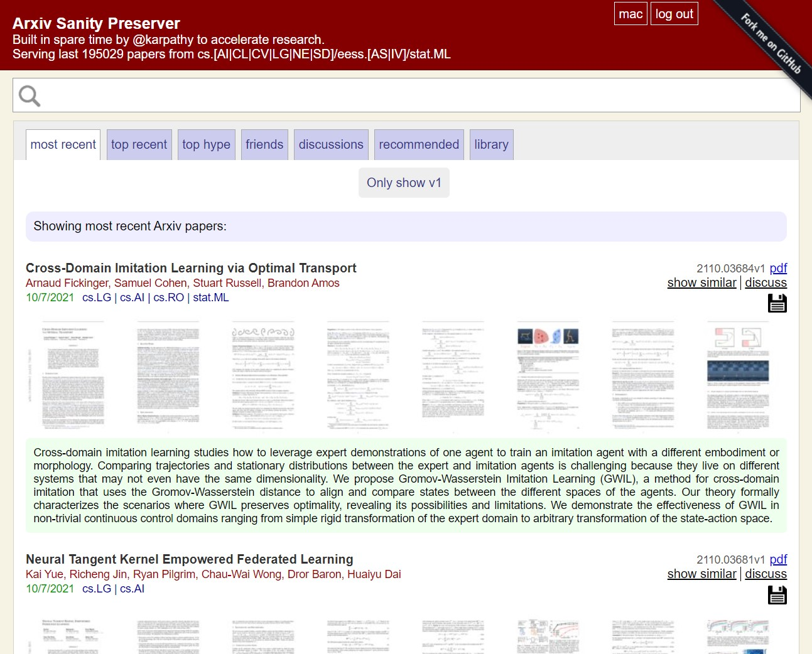

# arxiv sanity preserver

## About
This project is a web interface that attempts to tame the overwhelming flood of papers on Arxiv. It allows researchers to keep track of recent papers, search for papers, sort papers by similarity to any paper, see recent popular papers, to add papers to a personal library, and to get personalized recommendations of (new or old) Arxiv papers. This code is currently running live at [www.arxiv-sanity.com/](http://www.arxiv-sanity.com/), where it's serving 25,000+ Arxiv papers from Machine Learning (cs.[AI|CL|CV|LG|NE|SD]/eess.[AS|IV]/stat.ML) over all years. With this code base you could replicate the website to any of your favorite subsets of Arxiv by simply changing the categories in `fetch_papers.py`.



## Project components
#### Data preparing part
* `fetch_papers.py` is for query arxiv API and create a file `db.p` that contains all information for each paper.
* `download_pdfs.py` is for iterate over all papers in parsed pickle and downloads the papers into folder `pdf`.
* `thumb_pdf.py` is for export thumbnails of all downloaded pdfs to `thumb` pictures.
* `analyze.py` is for compute tfidf based on fetch info and save to `tfidf.p`, `tfidf_meta.p` and `sim_dict.p`.
* `buildsvm.py` is for train SVMs for all users (if any), exports a pickle `user_sim.p`
* `make_cache.py` is for save some fast searching data based on previous data and save to `db2.p` file.
* `twitter_daemon.py` is optional, which uses your Twitter API credentials (stored in `twitter.txt`) to query Twitter periodically looking for mentions of papers in the database, and writes the results to the pickle file `twitter.p`.
#### Run server part
* `serve.py` is for running a server

## Install dependencies before running code

#### Software
several software you need to install:
* [Python 3](https://www.python.org/): because all codes below depends on it
* [ImageMagick](http://www.imagemagick.org/script/index.php) :convert pdf to thumbnail
* [Ghostscript](https://ghostscript.com/releases/index.html) :`imagemagick` need it for pdf converting
* [Mongodb](https://www.mongodb.com/) :save infos from twitter
* [sqlite-tools](https://www.sqlite.org/download.html) :save infos of registered users

#### Python dependency
```bash
$ pip install -r requirements.txt
```

## Running code

#### Data preparing
`all_in_one.py` contains all data preparing part mentioned above, so just running `all_in_one.py` to do fetching,downloading,analyzing etc.:

```bash
python all_in_one.py
```

#### Running online and visiting
Run `python serve.py` and visit `your_ip:5000`. you can change port by using `port` parameter.

If you'd like to run server to outer world (e.g. AWS) run it as `python serve.py --prod` to use tornado instead of flask.

You also want to create a `secret_key.txt` file and fill it with random text (see top of `serve.py`).

